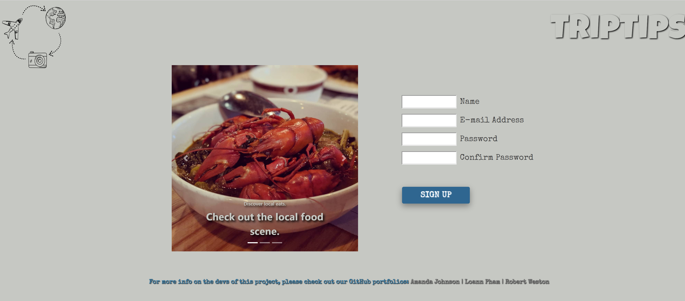

# **TripTips**

<br>
<p>TripTips is a social media app in which users are the driving force behind the kind of content that is curated. Its main purpose is to allow users to post pictures of their travels, whether it's beaches, museums, great restaurants, or outdoor activities. Other users can then pin those pictures to their own travel boards, which are populated by country/region. No need to read through endless- sometimes seemingly ranting reviews; just look through other users' pictures and decide for yourself what kind of adventure you're going to have!</p>

[Heroku Link](https://triptips-app.herokuapp.com/ "TripTips - Heroku")

## Getting Started

<p>To run this on your own system, you will need the following software:</p>

- VSCode or another code compiler
- Command Line software such as GitBash (or the one in VSCode works just fine)

### Prerequisites

- [Visual Studio Code](https://code.visualstudio.com/download "VSCode") - download latest version here
- [GitBash](https://git-scm.com/downloads "GitBash") - download latest version here
- [TripTips Repo](https://github.com/loannpham87/triptips "TripTips") - Cloning the repo

<br>

### Installing

**_Cloning the repo_**

<p>cd into the folder you would like the repo to be stored on, then type into Gitbash or any command line terminal: </p>

```

git clone https://github.com/loannpham87/triptips

```

1. Press enter and provide passphrase, if prompted.
1. Type this next command in your command line terminal to open the folder in VSCode:

```

code .

```

**_Downloading the Dependencies_**

<p>You will need to first download all of the dependency packages in the <strong>package.json</strong> in two different parts of the directory:</p>

- at the root
- in the client folder

<p>This can be achieved through the command line:</p>

_For root directory_

```

cd triptips

```

<p> press enter</p>

```

npm i --save

```

<p> press enter</p>

```

cd triptips/client

```

<p> press enter</p>

```

npm i --save

```

<p> press enter</p>
<br>

**_Creating the build folder for React_**

```

cd triptips/client

```

<p> press enter</p>

```

npm run build

```

<p> press enter</p>
<br>

**_Cloudinary API keys_**

<p> You will need to obtain your own API keys for uploading and storing media assets.</p>

[Cloudinary](https://cloudinary.com/users/register/free "Cloudinary API") - sign up here!

 <p>You will need to create a .env folder in the root directory. Your API keys should be stored in this format:</p>

```

# Cloudinary API keys
cloudinaryAPIKey = [Your API key]
cloudinaryAPISecret = [Your APISecret]
cloudinaryName = [Your cloudinaryName]

```

**_Starting the dev environment_**

<p>To run the front-end and back-end concurrently, type the following into your command line terminal: </p>

```
npm run dev
```

<p>Press enter</p>
<p>Congratulations, you are now ready to run TripTips!</p>
<br>

## Screenshots

**Home Page**

<br>
<br>
**Signup Page**

<br>
<br>
**Login Page**

<br>
<br>

## Built With

<hr><br>

- [React](https://reactjs.org/ "React") - Component-based JavaScript library for front-end dev
- [MongoDB](https://www.mongodb.com/ "MongoDB") - back end dev/data storage
- [Passport](https://www.npmjs.com/package/passport "Google") - user authentication
  <br>

## Authors

<hr><br>

- [Amanda Johnson](https://github.com/AmandaLuane) - _Back End_ - <p>contributions</p>

- [Loann Pham](https://github.com/loannpham87) - _Front End_ - <p>Initial setup of React folder structure. Setup of GitHub repo and Kanban board. UI/UX design for all front-end pages. Creating components with React for front-end pages. Heroku deployment. And a sick Readme.</p>

- [Robert Weston](https://github.com/rdweston1995) - _Back End_ - <p>Worked on backend with a focus on user login. Using MongoDB, Passport, and Redux to allow the user to sign up/login and remain signed in to the site.</p>
